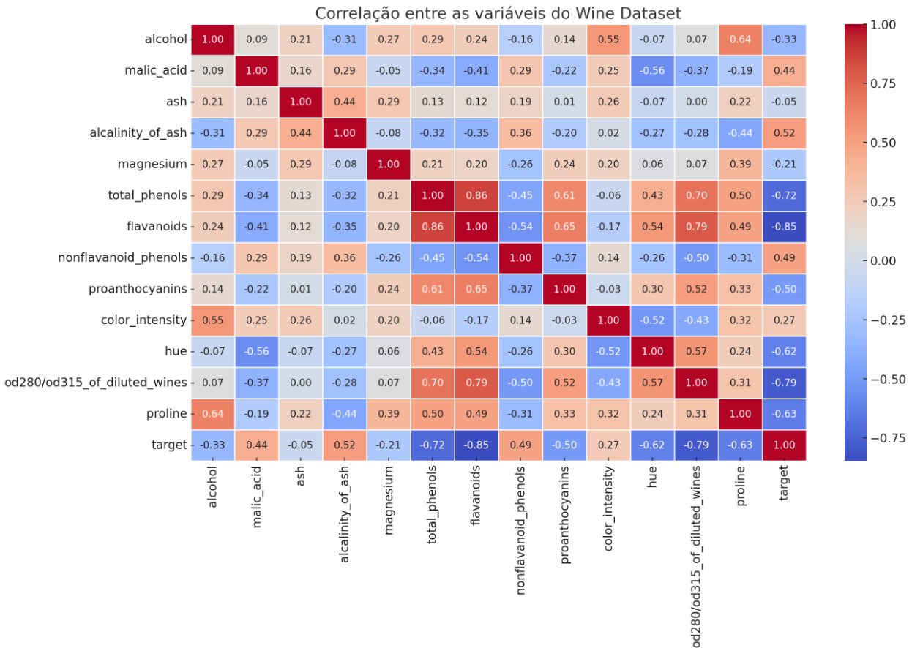
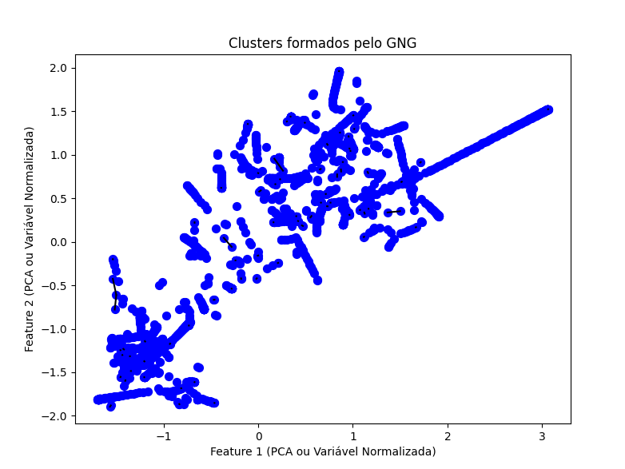
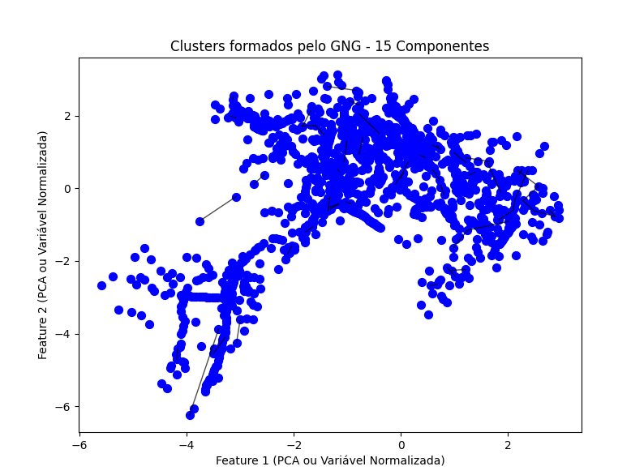

# Análise de Agrupamento com Growing Neural Gas (GNG)

Este projeto investiga **modelos neurais não supervisionados** aplicados ao **Wine Dataset** e ao **Forest Cover Dataset**, utilizando a técnica **Growing Neural Gas (GNG)** para mapear padrões de agrupamento e analisar a segmentação dos dados.

---

## 📂 Datasets Utilizados

### 1️⃣ Wine Dataset  
- **178 amostras**  
- **13 features**  
- **Descrição:** Classificação de tipos de vinho baseada em propriedades químicas.  
- **Arquivo:** `data/wine.csv`

### 2️⃣ Forest Cover Dataset  
- **581.012 amostras**  
- **54 features**  
- **Descrição:** Classificação de tipos de cobertura do solo com base em atributos topográficos e do solo.  
- **Arquivo:** `data/forest_cover.csv`  

---

## Objetivos do Projeto

- **Treinar um modelo GNG** para detectar padrões e agrupamentos nos datasets.  
- **Avaliar a formação dos clusters** e identificar possíveis **outliers**.  
- **Explorar variações nos parâmetros** do modelo (`learning_rate`, `max_age`, `número de neurônios`, `seleção de features`).  
- **Comparar a segmentação ao utilizar todas as variáveis vs. um subconjunto otimizado.**  
- **Diminuir a dimensionalidade do Forest Cover Dataset** com **PCA** para facilitar a segmentação.  

---

## Metodologia

1. **Exploração inicial dos dados** (distribuição das features, matriz de correlação).  
2. **Normalização dos dados** para garantir comparabilidade.  
3. **Redução de dimensionalidade** com **PCA** (*Forest Cover Dataset*).  
4. **Treinamento do GNG** utilizando diferentes configurações.  
5. **Análise dos gráficos gerados** para interpretar a segmentação dos clusters.  

---

##  Resultados e Análises

### 🔹 **1. Análise do Wine Dataset**

#### **Utilização das 5 dimensões mais correlacionadas**
A matriz de correlação foi utilizada para selecionar as 5 variáveis mais correlacionadas, melhorando a segmentação do modelo.

 **Correlação entre as variáveis do Wine Dataset:**  

#### 🔹 **Clusters e Outliers**
- O modelo **GNG detectou padrões**, mostrando como os dados se organizam naturalmente.  
- Os clusters apresentaram **uma organização linear**, indicando forte correlação entre algumas variáveis.  
- Algumas conexões mais longas indicam regiões menos povoadas do espaço.  

#### 🔹 **Homogeneidade dos Agrupamentos**
- Os neurônios do GNG se ajustaram a **regiões de maior densidade**, formando agrupamentos coerentes.  
- **Reduzir as features** para as 5 mais correlacionadas no Wine Dataset **melhorou a segmentação** e destacou um **padrão linear**.  

 **Clusters identificados pelo GNG no Wine Dataset:**  

---

### 🔹 **2. Aplicação no Forest Cover Dataset**

####  **Redução de dimensionalidade com PCA**
- O **Forest Cover Dataset** possui **54 features**, o que dificulta a visualização e segmentação direta.  
- Para contornar esse problema, foi aplicada a técnica **PCA com 15 componentes principais**, preservando **44,18% da variância total**.  

 **Gráfico da Variância Explicada pelo PCA:**  

#### 🔹 **Clusters no Forest Cover Dataset**
A aplicação do **GNG** no espaço gerado pelo **PCA** permitiu uma melhor visualização da segmentação dos dados.

 **Clusters identificados pelo GNG no Forest Cover Dataset:**  

#### 🔹 **Principais observações**
- A projeção no **espaço** manteve uma estrutura bem distribuída, destacando **agrupamentos naturais** nos dados.  
- O **número de neurônios e conexões** foi ajustado para evitar sobrecarga na rede e aumentar a **separação entre clusters**.  

---

## 🔹 **Variação de Parâmetros e Impacto na Segmentação**
Ajustar os hiperparâmetros do **GNG** teve um impacto significativo na segmentação dos dados.

- **Ajustes no `max_age`** quebraram conexões entre grupos, aumentando a separação.  
- **Redução do `learning_rate`** permitiu que os neurônios se acomodassem mais rapidamente aos padrões dos dados.  
- **A escolha de 15 componentes principais no PCA** ajudou a balancear **dimensionalidade e representatividade**.  

---

## ✅ Conclusão

- O **GNG conseguiu detectar a formação de clusters** tanto no **Wine Dataset** quanto no **Forest Cover Dataset**, apesar das diferenças no volume de dados.  
- A **redução de dimensionalidade com PCA** foi essencial para trabalhar com o **Forest Cover Dataset**, permitindo uma análise mais clara da segmentação.  
- A **variação dos parâmetros do GNG** teve um grande impacto na formação dos clusters, ajustando a granularidade da segmentação.  
- Os **resultados mostram que a escolha de features impacta diretamente** na qualidade da separação dos clusters, sendo um fator essencial na modelagem.  